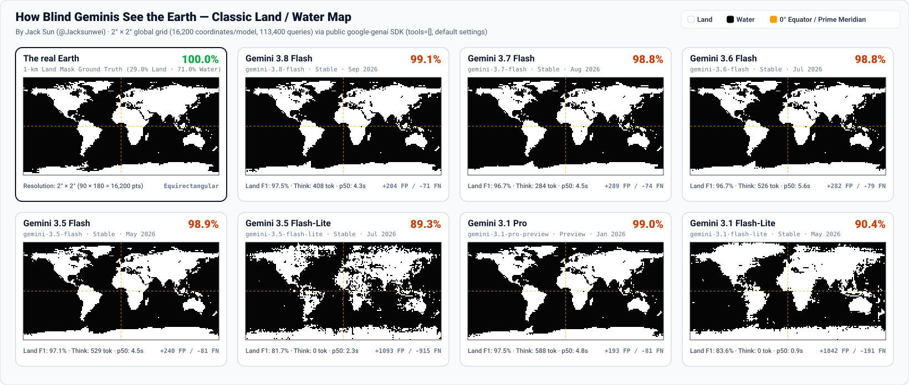
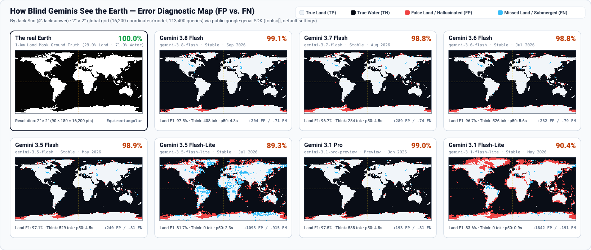
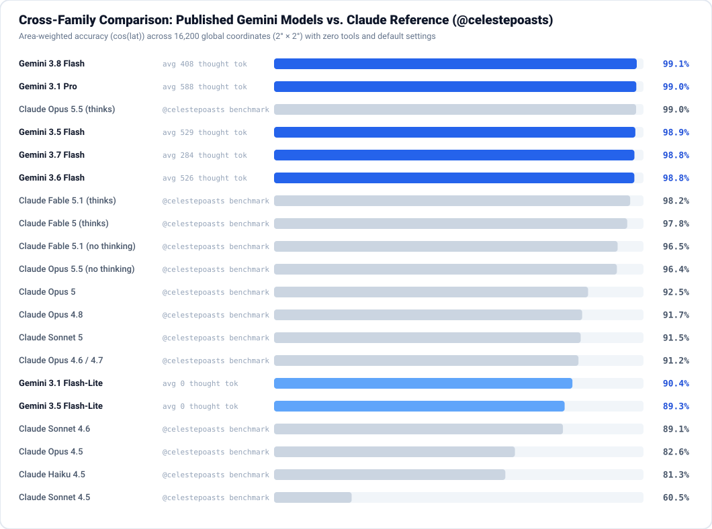

# How Blind Geminis See the Earth 🌍

[](https://jacksunwei.me/)
[](https://x.com/Jacksunwei)
[](https://github.com/Jacksunwei)
[](https://github.com/googleapis/python-genai)
[](data/all_models.jsonl)
[](LICENSE)

**Can an LLM reconstruct the entire world map purely from its parametric weights—one coordinate at a time, with zero tools?**

Built by **[Wei (Jack) Sun](https://jacksunwei.me/)** ([@Jacksunwei](https://x.com/Jacksunwei)) · Inspired by [@karpathy](https://x.com/karpathy) & [@celestepoasts](https://x.com/celestepoasts/status/2039451120042442950).

We query **7 published Gemini 3.x models** independently across all **16,200 cell centers** of a global $2^\circ \times 2^\circ$ grid ($90 \times 180$, **113,400 API calls**) using the official [`google-genai`](https://github.com/googleapis/python-genai) SDK (`tools=[]`, no web search, default settings):

```text
Answer with a single word, either "Land" or "Water", and nothing else: is ({lat}°{N/S}, {lon}°{E/W}) on land or water?
```

### Key Takeaways

- **99.1% World Map Accuracy**: Every thinking Gemini 3.x model reaches **98.8%–99.1%** area-weighted accuracy from weights alone—led by **`gemini-3.8-flash` (99.09%)** and **`gemini-3.1-pro-preview` (99.02%)**, matching **`Claude Opus 5.5 (thinks)` (99.0%)**.
- **Emergent Coastline Detector**: Plotting internal reasoning tokens (`thoughts_token_count`) per coordinate reveals that Gemini automatically spends **1.8×–2.6× more compute along coastlines and islands** than in deep oceans or continental interiors—even though the output is a single word.
- **31% More Token-Efficient**: `gemini-3.8-flash` edges out `gemini-3.1-pro-preview` (`99.09%` vs. `99.02%`) while using **31% fewer thinking tokens** (`408` vs. `588` avg).

---

## World Maps from Pure Weights



## Emergent Coastline Reasoning (`thoughts_token_count`)

Without being told where coastlines are, every thinking Gemini model dynamically scales test-time compute at land/water boundaries (`3,145` coastal cells vs. `13,055` interior cells). Non-thinking `Flash-Lite` models (`0` thinking tokens by default) answer in a single forward pass.


| Model | Coastal Thinking | Interior Thinking | Coastal / Interior Ratio | Coastal Acc | Interior Acc |
| :--- | ---: | ---: | ---: | ---: | ---: |
| **Gemini 3.8 Flash** | 788 tok | 304 tok | **2.6×** | 96.88% | 99.65% |
| **Gemini 3.1 Pro** | 1037 tok | 465 tok | **2.2×** | 96.26% | 99.74% |
| **Gemini 3.5 Flash** | 866 tok | 437 tok | **2.0×** | 95.96% | 99.66% |
| **Gemini 3.7 Flash** | 446 tok | 239 tok | **1.9×** | 95.60% | 99.59% |
| **Gemini 3.6 Flash** | 818 tok | 446 tok | **1.8×** | 95.41% | 99.63% |

## Where Models Hallucinate (False Positives vs. False Negatives)

Red pixels mark **hallucinated land** (`False Positive`: mostly coastal shelves and small island chains); blue pixels mark **submerged land** (`False Negative`).



---

## Leaderboard & Cross-Family Comparison



Primary accuracy is weighted by spherical surface area $w(\phi) = \cos(\phi)$ against a 1-km global ground-truth mask (29.0% Land, 71.0% Water).

| Rank | Model | Public API ID | Area Acc | Raw Grid Acc | Land F1 | Avg Thinking Tokens |
| :--- | :--- | :--- | ---: | ---: | ---: | ---: |
| **#1** | **Gemini 3.8 Flash** | `gemini-3.8-flash` | **99.09%** | 98.30% | 97.48% | 408 *(p95: 1061)* |
| **#2** | **Gemini 3.1 Pro** | `gemini-3.1-pro-preview` | **99.02%** | 98.31% | 97.48% | 588 *(p95: 1188)* |
| **#3** | **Gemini 3.5 Flash** | `gemini-3.5-flash` | **98.90%** | 98.02% | 97.07% | 529 *(p95: 1130)* |
| **#4** | **Gemini 3.7 Flash** | `gemini-3.7-flash` | **98.78%** | 97.76% | 96.70% | 284 *(p95: 611)* |
| **#5** | **Gemini 3.6 Flash** | `gemini-3.6-flash` | **98.76%** | 97.77% | 96.71% | 526 *(p95: 1064)* |
| **#6** | **Gemini 3.1 Flash-Lite** | `gemini-3.1-flash-lite` | **90.38%** | 87.45% | 83.65% | 0 *(non-thinking)* |
| **#7** | **Gemini 3.5 Flash-Lite** | `gemini-3.5-flash-lite` | **89.33%** | 87.60% | 81.68% | 0 *(non-thinking)* |

<details>
<summary><strong>📊 Full Breakdown (Precision/Recall, FP/FN, Latency) & Individual Map Downloads</strong></summary>

<br>

| Rank | Model | Release | Land Prec / Rec | Pred Land % | Errors (FP / FN) | Median Latency | Enriched Dataset |
| :--- | :--- | :--- | ---: | ---: | ---: | ---: | :--- |
| **#1** | **Gemini 3.8 Flash** (`gemini-3.8-flash`) | Stable · Sep 2026 | 96.3% / 98.7% | 29.1% | +204 / -71 | 4.26s | [gemini-3.8-flash.jsonl](data/gemini-3.8-flash.jsonl) |
| **#2** | **Gemini 3.1 Pro** (`gemini-3.1-pro-preview`) | Preview · Jan 2026 | 96.5% / 98.5% | 29.1% | +193 / -81 | 4.84s | [gemini-3.1-pro.jsonl](data/gemini-3.1-pro.jsonl) |
| **#3** | **Gemini 3.5 Flash** (`gemini-3.5-flash`) | Stable · May 2026 | 95.7% / 98.5% | 29.2% | +240 / -81 | 4.52s | [gemini-3.5-flash.jsonl](data/gemini-3.5-flash.jsonl) |
| **#4** | **Gemini 3.7 Flash** (`gemini-3.7-flash`) | Stable · Aug 2026 | 94.8% / 98.6% | 29.4% | +289 / -74 | 4.53s | [gemini-3.7-flash.jsonl](data/gemini-3.7-flash.jsonl) |
| **#5** | **Gemini 3.6 Flash** (`gemini-3.6-flash`) | Stable · Jul 2026 | 95.0% / 98.5% | 29.4% | +282 / -79 | 5.58s | [gemini-3.6-flash.jsonl](data/gemini-3.6-flash.jsonl) |
| **#6** | **Gemini 3.1 Flash-Lite** (`gemini-3.1-flash-lite`) | Stable · May 2026 | 73.8% / 96.5% | 36.1% | +1842 / -191 | 0.87s | [gemini-3.1-flash-lite.jsonl](data/gemini-3.1-flash-lite.jsonl) |
| **#7** | **Gemini 3.5 Flash-Lite** (`gemini-3.5-flash-lite`) | Stable · Jul 2026 | 80.4% / 83.0% | 28.1% | +1093 / -915 | 2.32s | [gemini-3.5-flash-lite.jsonl](data/gemini-3.5-flash-lite.jsonl) |

### Individual Per-Model Maps & Datasets

- **All 7 Models Combined (`113,400` rows)**: [`data/all_models.jsonl`](data/all_models.jsonl) · [`data/all_models.csv`](data/all_models.csv)
- **Composite High-Res Figures**: [Classic B&W (PNG)](assets/world_maps_bw.png) · [Thinking Heatmap (PNG)](assets/world_maps_thinking.png) · [Error Map (PNG)](assets/world_maps_diff.png) · [Comparison Chart (PNG)](assets/cross_family_comparison.png)

| Model | Classic Map | Error Map | Thinking Heatmap | Raw Dataset |
| :--- | :--- | :--- | :--- | :--- |
| **The real Earth** *(1-km Ground Truth)* | [SVG](assets/maps/ground_truth.svg) · [PNG](assets/maps/ground_truth.png) | — | — | [ground_truth_90x180.json](data/ground_truth_90x180.json) |
| **Gemini 3.8 Flash** (`gemini-3.8-flash`) | [SVG](assets/maps/gemini-3.8-flash_bw.svg) · [PNG](assets/maps/gemini-3.8-flash_bw.png) | [SVG](assets/maps/gemini-3.8-flash_diff.svg) · [PNG](assets/maps/gemini-3.8-flash_diff.png) | [SVG](assets/maps/gemini-3.8-flash_thinking.svg) · [PNG](assets/maps/gemini-3.8-flash_thinking.png) | [gemini-3.8-flash.jsonl](data/gemini-3.8-flash.jsonl) |
| **Gemini 3.7 Flash** (`gemini-3.7-flash`) | [SVG](assets/maps/gemini-3.7-flash_bw.svg) · [PNG](assets/maps/gemini-3.7-flash_bw.png) | [SVG](assets/maps/gemini-3.7-flash_diff.svg) · [PNG](assets/maps/gemini-3.7-flash_diff.png) | [SVG](assets/maps/gemini-3.7-flash_thinking.svg) · [PNG](assets/maps/gemini-3.7-flash_thinking.png) | [gemini-3.7-flash.jsonl](data/gemini-3.7-flash.jsonl) |
| **Gemini 3.6 Flash** (`gemini-3.6-flash`) | [SVG](assets/maps/gemini-3.6-flash_bw.svg) · [PNG](assets/maps/gemini-3.6-flash_bw.png) | [SVG](assets/maps/gemini-3.6-flash_diff.svg) · [PNG](assets/maps/gemini-3.6-flash_diff.png) | [SVG](assets/maps/gemini-3.6-flash_thinking.svg) · [PNG](assets/maps/gemini-3.6-flash_thinking.png) | [gemini-3.6-flash.jsonl](data/gemini-3.6-flash.jsonl) |
| **Gemini 3.5 Flash** (`gemini-3.5-flash`) | [SVG](assets/maps/gemini-3.5-flash_bw.svg) · [PNG](assets/maps/gemini-3.5-flash_bw.png) | [SVG](assets/maps/gemini-3.5-flash_diff.svg) · [PNG](assets/maps/gemini-3.5-flash_diff.png) | [SVG](assets/maps/gemini-3.5-flash_thinking.svg) · [PNG](assets/maps/gemini-3.5-flash_thinking.png) | [gemini-3.5-flash.jsonl](data/gemini-3.5-flash.jsonl) |
| **Gemini 3.5 Flash-Lite** (`gemini-3.5-flash-lite`) | [SVG](assets/maps/gemini-3.5-flash-lite_bw.svg) · [PNG](assets/maps/gemini-3.5-flash-lite_bw.png) | [SVG](assets/maps/gemini-3.5-flash-lite_diff.svg) · [PNG](assets/maps/gemini-3.5-flash-lite_diff.png) | [SVG](assets/maps/gemini-3.5-flash-lite_thinking.svg) · [PNG](assets/maps/gemini-3.5-flash-lite_thinking.png) | [gemini-3.5-flash-lite.jsonl](data/gemini-3.5-flash-lite.jsonl) |
| **Gemini 3.1 Pro** (`gemini-3.1-pro-preview`) | [SVG](assets/maps/gemini-3.1-pro_bw.svg) · [PNG](assets/maps/gemini-3.1-pro_bw.png) | [SVG](assets/maps/gemini-3.1-pro_diff.svg) · [PNG](assets/maps/gemini-3.1-pro_diff.png) | [SVG](assets/maps/gemini-3.1-pro_thinking.svg) · [PNG](assets/maps/gemini-3.1-pro_thinking.png) | [gemini-3.1-pro.jsonl](data/gemini-3.1-pro.jsonl) |
| **Gemini 3.1 Flash-Lite** (`gemini-3.1-flash-lite`) | [SVG](assets/maps/gemini-3.1-flash-lite_bw.svg) · [PNG](assets/maps/gemini-3.1-flash-lite_bw.png) | [SVG](assets/maps/gemini-3.1-flash-lite_diff.svg) · [PNG](assets/maps/gemini-3.1-flash-lite_diff.png) | [SVG](assets/maps/gemini-3.1-flash-lite_thinking.svg) · [PNG](assets/maps/gemini-3.1-flash-lite_thinking.png) | [gemini-3.1-flash-lite.jsonl](data/gemini-3.1-flash-lite.jsonl) |

</details>

---

## Quick Start

Requires Python 3.10+ and [`uv`](https://docs.astral.sh/uv/):

```bash
uv sync

# 1. Run or resume the 16,200-coordinate benchmark via public google-genai SDK
export GEMINI_API_KEY="your-api-key"
uv run python run_eval.py --models gemini-3.8-flash --concurrency 150

# 2. Regenerate all SVG/PNG figures, datasets, and README.md
uv run python render_report.py
```

---

## About the Author

**[Wei (Jack) Sun](https://jacksunwei.me/)** — Hands-on with agentic AI all day: building frameworks at Google, reading what the industry ships, and writing it down.

- **X / Twitter**: [@Jacksunwei](https://x.com/Jacksunwei)
- **GitHub**: [@Jacksunwei](https://github.com/Jacksunwei)
- **Blog**: [jacksunwei.me](https://jacksunwei.me/) — daily AI digest (Tech, Research, News) and essays ([RSS](https://jacksunwei.me/feed.xml))

| Project | Description |
| :--- | :--- |
| **[`google/adk-python`](https://github.com/google/adk-python)** | Open-source, code-first Python toolkit for building, evaluating, and deploying sophisticated AI agents. |
| **[`gemini-web-mcp`](https://github.com/Jacksunwei/gemini-web-mcp)** | Gemini-powered MCP server for real Google Search grounding, multi-URL synthesis, and Nano Banana image generation. |

## License

[Apache-2.0](LICENSE)
